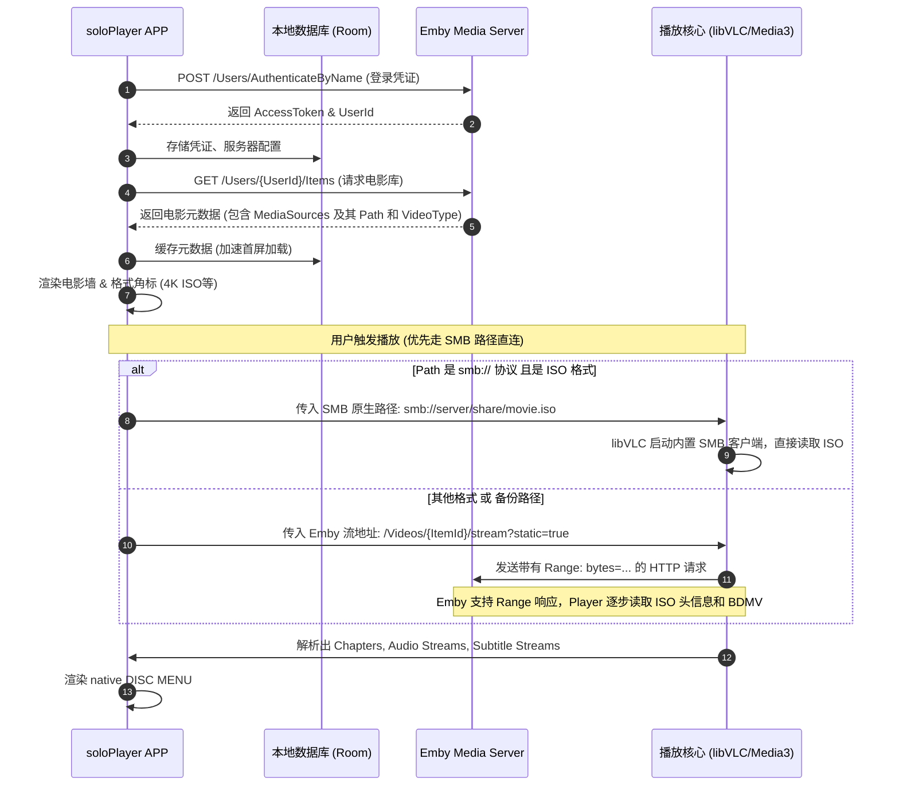

# soloPlayer - 高端家庭影院 ISO 光盘媒体播放器设计与规划文档

本设计文档旨在为 **soloPlayer**（Android TV 平台高端家庭影院播放器）提供完整的技术方案和实施计划。soloPlayer 专注于解决发烧友用户的痛点：**以 Emby 为媒体源，支持完整的 ISO 光盘（DVD/蓝光）播放及菜单导航。**

---

## 1. 架构设计与关键技术选型

遵循 Android 官方架构指南及 `AGENTS.md` 规范，采用现代 Android 开发技术栈，并针对 Android TV 特性进行专项优化。

### 1.1 核心技术栈选型

| 模块 | 技术选型 | 选型依据与优势 |
| :--- | :--- | :--- |
| **UI 框架** | Jetpack Compose for TV<br>(`androidx.tv:tv-foundation`<br>`androidx.tv:tv-material`) | 官方推荐的 TV 声明式 UI 框架，内置对 D-Pad 焦点管理、边缘阴影、缩放动画等 TV 特有交互的良好支持。 |
| **架构模式** | 现代单向数据流 (UDF) + MVVM | ViewModel 暴露只读 `StateFlow`/`SharedFlow`，UI 订阅并响应，确保 TV 界面焦点与数据状态的绝对同步，防止焦点丢失（TV 开发的核心痛点）。 |
| **依赖注入** | Hilt | 减少样板代码，便于注入 Repository、Network 客户端及 Dispatchers，利于单元测试。 |
| **异步/流处理**| Kotlin Coroutines & Flow | 官方首选并发方案，实现非阻塞 of Emby 接口请求、本地数据库查询及播放进度上报。 |
| **本地数据库** | Room | 用于缓存 Emby 媒体库元数据、本地播放历史（备用）、用户个性化播放设置。 |
| **网络请求** | Retrofit + OkHttp | 用于高效与 Emby Server API 通信。OkHttp 配置大缓冲区和超时时间，优化大文件流式传输的握手。 |

---

### 1.2 核心播放引擎：双引擎架构 (Dual-Engine)

由于 **Google Media3/ExoPlayer 不支持 ISO 格式及光盘菜单导航**，本应用必须采用**双引擎架构**：

```
                    ┌──────────────────────────┐
                    │      soloPlayer UI       │
                    └─────────────┬────────────┘
                                  │ 播放分发器
                                  ▼
                    ┌──────────────────────────┐
                    │    PlaybackDispatcher    │
                    └──────┬────────────┬──────┘
                           │            │
             ISO 格式      │            │  MKV / MP4 格式
             (DVD/蓝光)    ▼            ▼
               ┌──────────────┐      ┌──────────────┐
               │ libVLC Core  │      │ Media3 Core  │
               │  (MediaPlayer)│     │ (ExoPlayer)  │
               └──────────────┘      └──────────────┘
```

1. **ExoPlayer / Media3 (主引擎)**：
   * **适用格式**：MKV, MP4 等标准流媒体格式。
   * **优势**：Android 系统深度优化，解码效率极高，完美支持 HDR10、Dolby Vision、Dolby Atmos/DTS-HD 音轨源码输出（Audio Passthrough）。
2. **libVLC for Android (ISO 专有引擎)**：
   * **适用格式**：DVD `.iso`, BD (蓝光) `.iso`。
   * **优势**：
     * 内置 `libdvdnav` 和 `libdvdread`，完美支持 DVD 交互式动态菜单导航。
     * 支持读取蓝光光盘结构（BDMV 目录及 `.mpls` 播放列表），能提取各播放轨道、音轨、字幕。
     * 原生支持以 HTTP 协议读取 ISO（通过 HTTP Range 头向 Emby 发送偏移请求），实现无缝在线串流播放大体积 ISO，无需整包下载。

---

### 1.3 蓝光菜单导航的折中方案：简易导航（Lite Menu）与完整菜单

由于 Android 平台无法运行 BD-J (Java) 虚拟机（Android 运行 ART，而非标准 Oracle JRE），**蓝光 BD-J 动态菜单在 Android TV 上难以完美原生渲染**。
因此，soloPlayer 采用**双重导航方案**：
* **DVD 导航**：使用 `libVLC` 的 `libdvdnav`，通过 D-Pad 直接操作 DVD 画面上的原生菜单按键。
* **蓝光导航 - 简易导航模式 (Play with Lite Menu)**：如原型图 (Image 2 & 3) 所示，应用自动解析 ISO 的 BDMV 结构，抓取主视频轨道和章节（Chapters），以**原生 TV UI 弹窗（DISC MENU）**提供“播放”、“场景选择”（带缩略图章节）、“音轨切换”、“字幕选择”。这既规避了 BD-J 虚拟机的技术障碍，又提供了统一的高端视觉体验。

---

## 2. 应用功能地图 (App Feature Map)


---

## 3. 数据流转与串流架构 (Data Flow)

针对 Emby 服务器作为数据源、支持 SMB 路径直连及 ISO 文件远程串流的特性，设计如下数据流转机制：

### 3.1 基础元数据与媒体流转（含 SMB 直连播放逻辑）

1. **元数据获取与 SMB 路径解析**：
   * Emby 扫描库文件时如果配置了路径替换（Path Substitution），API 返回的 `MediaSources` 数组中将包含原生网络共享路径（如 `smb://192.168.1.100/Share/movie.iso`）。
   * 客户端获取电影元数据时，优先读取 `MediaSource.Path` 并检测其协议前缀。
2. **播放分发路由**：
   * **SMB 协议直连播放（推荐）**：如果检测到 `Path` 为 `smb://` 开头，且引擎为 `libVLC`：
     * 客户端直接将 `smb://[user:pass@]ip/share/path.iso` 地址传给 libVLC Core。
     * libVLC 原生支持 SMB 协议（内置 libsmb2 库），可直接建立 SMB 网络会话读取文件结构，实现超低延迟的寻轨和菜单渲染，完全绕过 Emby 服务器的流媒体包装，减轻服务器负载。
     * *注：如果为 ExoPlayer 播放常规 MKV/MP4，将回退到 Emby 的标准 HTTP 直连流地址（由 Emby 服务端担当 SMB-to-HTTP 的中转桥梁）。*
   * **HTTP 流媒体串流（备份）**：如果路径为本地或无权直连的 SMB，客户端则传入 Emby 静态流地址 `http://[EmbyIP]/Videos/[ItemId]/stream?static=true`。通过 OkHttp 响应 HTTP Range 分包请求。



### 3.2 播放进度同步数据流 (Playback Progress Sync)

为确保在 TV 端观看 ISO 时，Emby 服务端的“继续观看”和“已观看”状态实时更新：

1. **播放开始**：当 Player 开始解码并播放时，向 Emby 发送 `POST /Sessions/Playing`，创建播放会话。
2. **心跳与进度上报**：
   * 开启协程定时器，**每隔 10 秒**向 Emby 发送一次 `POST /Sessions/Playing/Progress`。
   * 请求体关键字段：
     ```json
     {
       "ItemId": "12345",
       "PositionTicks": 50490000000,  // 1ms = 10,000 ticks
       "IsPaused": false,
       "PlaySessionId": "xyz...",
       "EventName": "TimeUpdate"
     }
     ```
   * 当发生“暂停”(`Pause`)、“恢复”(`Unpause`)、“快进/快退”(`Seek`) 等事件时，**立即触发一次上报**，以确保多端同步无延迟。
3. **播放结束**：当用户主动返回或影片播放完毕，向 Emby 发送 `POST /Sessions/Playing/Stopped`，注销播放会话，Emby 记录最终观看进度。

---

## 4. 遥控器导航链路 (Remote Control Navigation Link)

TV 端交互的生命线是**遥控器 D-Pad 导航**。soloPlayer 针对各核心页面的焦点移动逻辑做出如下精确规划：

### 4.1 核心页面焦点切换规则

#### 1. 主页 (Home) 与侧边栏 (Sidebar) 切换
* **侧边栏收起/展开**：侧边栏默认处于“收起（Icon-only）”状态。
* **焦点进入侧边栏**：在主页内容区最左侧的元素（如 Featured Banner 的 Play 按钮，或 Continue Watching 的第一个卡片）上按 **Left 键**，焦点转移到侧边栏，侧边栏向右滑动展开，显示完整文字标签。
* **侧边栏导航**：在侧边栏内，按 **Up / Down 键**在导航项（主页、电影、电视剧、媒体库、设置）之间移动。
* **焦点离开侧边栏**：在侧边栏任一选项上按 **Right 键**，焦点返回主页内容区之前获得焦点的元素上，侧边栏收起。

#### 2. 电影详情页 (Movie Details) 导航
* 页面分为三个水平焦点带：
  1. **顶栏/侧边栏**（若侧边栏未收起）
  2. **主操作按钮区**（Play Movie, Play with Disc Menu）
  3. **章节轨道区**（Chapters Horizontal List）
* **下移链路**：在“Play Movie”按钮上按 **Down 键**，焦点直接落在下方“Chapter 1”卡片上。
* **横向链路**：在章节列表内，按 **Left / Right 键**进行水平滚动导航。当到达最左侧章节卡片并继续按 **Left 键**时，焦点将移向左侧的收缩状态侧边栏。

---

### 4.2 播放器交互与 DISC MENU 焦点捕获

由于播放界面多为半透明 Overlay，焦点管理极为关键，必须防止 D-Pad 误触底层视频流：

```
                    ┌──────────────────────────┐
                    │       视频渲染层          │ (无焦点)
                    └────────────┬─────────────┘
                                 │ D-Pad 激活
                                 ▼
                    ┌──────────────────────────┐
                    │    播放控制面板 Overlay    │ (焦点捕获)
                    └────────────┬─────────────┘
                                 │ 按 "UP" 键 / 菜单键
                                 ▼
                    ┌──────────────────────────┐
                    │    DISC MENU 弹窗 Overlay │ (强焦点锁)
                    └──────────────────────────┘
```

1. **常规播放状态**：界面无焦点，D-Pad 输入处于睡眠状态。
2. **唤醒控制栏**：按 D-Pad 任意方向键或 **OK 键**，调出“播放控制面板”（包含进度条、播放/暂停、快进等按钮），焦点立即锁定在“暂停/播放”中心按钮上。**10秒无操作后，控制面板自动淡出，焦点归零。**
3. **呼出 DISC MENU Overlay**：
   * 在控制面板显示状态下，按 **Up 键**，或者直接按下遥控器上的**菜单键 (Menu Key)**，将呼出居中的 `DISC MENU` 悬浮窗。
   * **强焦点锁定 (Focus Trap)**：一旦 `DISC MENU` 弹出，焦点被强行限制在弹窗内的垂直菜单项中（Play、Scene Selection、Audio、Subtitles）。
   * 按 **Down 键**移动到 "Scene Selection"，按 **OK 键**展开右侧或下方的章节缩略图网格。此时焦点转移至章节网格。
   * **退出机制**：按遥控器 **Back 键**，焦点回退到主播放控制栏，再按 **Back 键**，关闭所有 Overlay，恢复全屏播放。

---

## 5. 详细实施计划与步骤

```markdown
- [ ] **Phase 1: 项目骨架与 Hilt 依赖注入搭建**
    - [ ] 配置项目的 `build.gradle.kts`，升级 Kotlin 及 Gradle 插件。
    - [ ] 引入 `androidx.tv:tv-foundation` 和 `androidx.tv:tv-material`。
    - [ ] 初始化 `Hilt` 依赖注入框架，搭建 `BaseApplication` 及基础 DI Modules（网络层、数据库层）。
- [ ] **Phase 2: Emby SDK / 网络客户端实现**
    - [ ] 封装 Retrofit HTTP 客户端，编写 `EmbyApiService`。
    - [ ] 实现用户登录（AuthenticateByName）、获取媒体库目录、获取电影详情的 API。
    - [ ] 编写播放进度心跳上报服务（Heartbeat Progress Sync Service）。
- [ ] **Phase 3: Android TV 主体界面开发 (Jetpack Compose TV)**
    - [ ] 实现可收缩/展开的 TV 侧边栏导航组件 (`TVNavigationDrawer`)。
    - [ ] 编写 **Home 页面**：实现 Featured Banner 自动推荐，搭建 Continue Watching 横向对焦列表。
    - [ ] 编写 **Movies Library 页面**：支持网格海报墙，实现右上角 Genre/Year/Format 过滤下拉菜单。
    - [ ] 编写 **Movie Details 页面**：高斯模糊背景海报，实现“直接播放”与“光盘菜单播放”对焦按钮，章节卡片横向对焦滑动。
    - [ ] 编写 **Settings 页面**：左侧分类对焦列表，右侧配置项（关联文件夹、同步开关、频率下拉选择）。
- [ ] **Phase 4: 双播放引擎开发与分发器集成**
    - [ ] 引入 Media3 / ExoPlayer 依赖，实现 MKV/MP4 标准播放核心。
    - [ ] 引入 `libvlc-android` 依赖，编译或集成支持 ISO 播放性的 libVLC 包。
    - [ ] 实现 `PlaybackDispatcher`，根据 Emby 返回的电影 `VideoType` 自动路由至对应播放引擎。
    - [ ] 实现 libVLC 的 HTTP Range 串流数据流，测试远程大体积 ISO 的首帧加载速度和寻轨寻章节延迟。
- [ ] **Phase 5: 原生 DISC MENU 弹窗与遥控器焦点微调**
    - [ ] 编写自定义 `DiscMenu` Composable 弹窗。
    - [ ] 实现 DVD 动态菜单的按键映射（将 Android 遥控器的 D-Pad 转换为 `libvlc_video_navigate` 的 DVD 导航事件）。
    - [ ] 针对蓝光 ISO，实现解析 `.mpls` 列表提取章节，并绑定到原生“场景选择”缩略图上。
    - [ ] 解决 Compose TV 中焦点漂移问题，确保 Back 键能完美层层回退。
- [ ] **Phase 6: 性能优化与兼容性测试**
    - [ ] 音视频直通（Audio Passthrough）功能测试，支持 DTS/Dolby 源码输出至功放。
    - [ ] 内存泄漏与帧率审计（利用 Compose Layout Inspector 和 Profile GPU Rendering 确保 60fps 滚动）。
    - [ ] 在真机 TV/盒子（如 Shield TV, 小米盒子, 索尼电视）上进行遥控器适配测试。
```

---

## 6. 验证计划 (Verification Plan)与模拟器测试方案

### 6.1 模拟器自动化测试与 Bug 修复方案 (Emulator Automation)
本开发环境已检测到配置好的 Android TV 模拟器：**`Television_1080p`**。我们将使用项目目录中内置的自动化测试脚本工具集（位于 `.github/skills/testing_and_automation/android-emulator-skill/scripts/`）进行集成测试和快速 Debug。

测试执行工作流：
1. **启动/关闭模拟器**：使用 `emulator_manage.py` 脚本自动化拉起/关闭本地的 `Television_1080p` TV 模拟器。
   ```bash
   python3 .github/skills/testing_and_automation/android-emulator-skill/scripts/emulator_manage.py --boot Television_1080p
   ```
2. **应用编译与部署**：使用 `build_and_test.py` 自动化 Gradle 任务，编译并安装 APK 到模拟器中。
   ```bash
   python3 .github/skills/testing_and_automation/android-emulator-skill/scripts/build_and_test.py --task installDebug
   ```
3. **UI 元素与焦点抓取 (Screen Mapping)**：使用 `screen_mapper.py` 导出 UI 层次结构 XML 并解析交互组件，帮助确认 D-Pad 焦点当前落在哪个 Composable 元素上。
4. **遥控器按键与导航自动化 (Navigator & Keyboard)**：通过 `keyboard.py` 模拟遥控器 D-Pad 按键动作（如 Back、Enter、Up、Down、Left、Right），测试侧边栏抽屉自动展开、详情页按钮交互，以及呼出 DISC MENU 后焦点是否被正确锁在弹窗内。
5. **异常监控与日志分析 (Log Monitor)**：使用 `log_monitor.py` 在测试运行期间监控 `adb logcat`，过滤 soloPlayer 包名下的 Error 级别日志或 VLC 播放引擎抛出的底层音视频异常，便于快速拦截并修复 bug。

### 6.2 自动化测试
* **单元测试 (JUnit 5 + MockK)**：
  * 测试 `PlaybackDispatcher` 的分发逻辑，输入 ISO 路径应正确路由至 libVLC 引擎，输入 MKV 路径应正确路由至 ExoPlayer。
  * 测试 Emby 进度同步计时器：模拟播放 30 秒，验证心跳上报接口是否按 10s 间隔触发 3 次，且数据结构中的 Ticks 换算正确。
* **界面对焦测试 (Compose Test Rule)**：
  * 模拟按下遥控器 Left/Right 键，验证 `TVNavigationDrawer` 的展开状态以及焦点是否正确转移。

### 6.3 手动测试 (TV 真机环境)
1. **网络流媒体测试**：部署本地 Emby Server，存入 80GB 的蓝光 ISO 和 10GB 的 DVD ISO。在 Android TV 模拟器或电视盒子上连接 Emby，测试加载时间是否控制在 3-5 秒内。
2. **DISC MENU 验证**：
   * 播放 DVD ISO，点击 "Play with Disc Menu"，验证是否能看到 DVD 原生菜单，且遥控器能操作菜单上的按钮。
   * 播放 4K 蓝光 ISO，点击 "Play with Disc Menu"，验证能否弹出原生 Compose 制作的 `DISC MENU` 悬浮窗，选择“音轨”或“场景”后画面能正确切换并继续流畅播放。
3. **Emby 心跳一致性验证**：播放 ISO 到 15 分钟时退出，检查手机端 Emby App 或网页端该影片的“继续观看”进度是否为 15 分钟。
